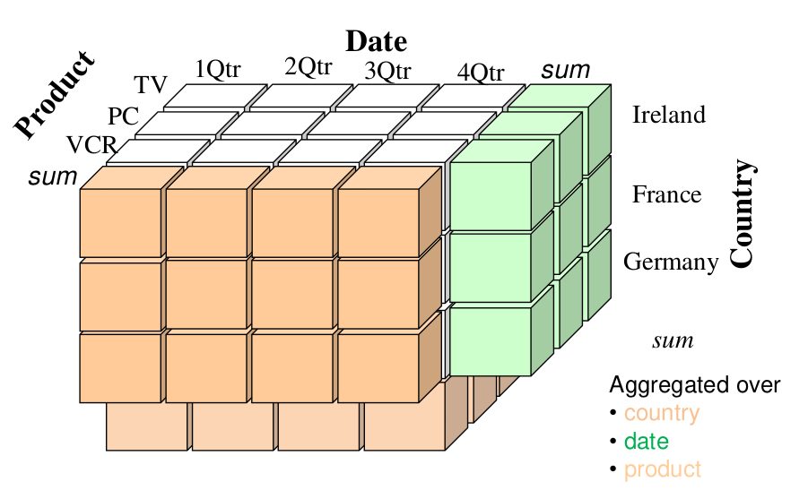

# 1. Online analytical processing
## 1.1. Conceptual model : data cubes

### 1.1.1. Conceptual models
A conceptual model (in opposition to physical model, logical model) means
- We need to force ourselves to avoid any word of computer science
- This way we can discuss to the client, we decide of the using of a technology with the top of the department, this is already the **logical model** (we choose the best technology to implement the application)
  - Example : **relational database** instead of [...]

Data cube : a way to conceptualize the way of thinking. In a supermarket DW, we can see it in 3 dimensions. In this 3D space we need to put a measure : the **product cost**

### 1.1.2. Dimensions, hiearchies, measures

We build a 3D space with 
- Dimensions : customer, store, product
- Hierarchies : the far we go in one dimension, bigger the scale gets. For example :
  - Customer : 
    1. ID 
    2. City
    3. State 
    4. Country
  - Store : 
    1. Chain 
    2. Size 
    3. Location
  - Product 
    1. Brand
    2. Type

In each of these cells, we could have some relevant information that is related to the 3. 

### 1.1.3. Examples
***Example of the supermarket** :
Imagine we buy two bottles of Coca but they are scanned at a different time, so they are different lines in the database. In the DW, they should be stored at one coordinate of the **product** dimension.*

***Example of the CERN** : they have petabytes of information per second. They need to collect everything, technology to collect all in once. They built a pipeline of captors :*
- *They needed to receive a particle*
- *Have an algorithm to know if it was interesting enough to keep it or if it could go to the next level*
- *At the next level the same thing happens but we have more time to decide if it is interesting enough*

### Cross tabulation
We can see the cubic model also in the cross tabulation, for example in Excel. We have multiple dimensions, and then we often have more general columns such as "total" which build the hierarchy. We call these "level of aggregation".

Applied to our cube, this gives the following (for example, the first layer makes a sum of all products, by date, for Ireland).

### Real-life application
See slides 54-58 !

### Databases, aggregation, and Data Warehouses
Data in database is like in cubes. We need to aggregate it. **The aggregation should already be computed when we put in the DW**!!

However, we need to be smart. We need to decide which cells we need to aggregate, which cells can simply be derived from others (the black ones) by a SQL query.

### SSAS
SQL Server Analysis Service

