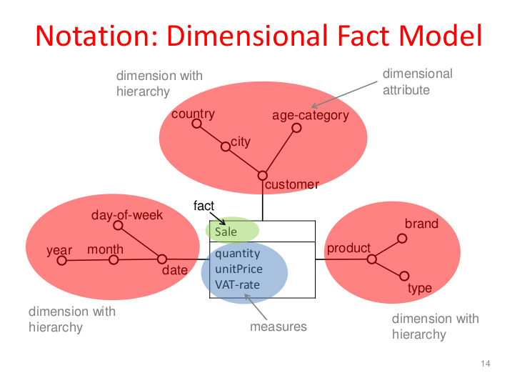

# 1. Course 5 (12 october)
## 1.1. Discussion about building a DW
When we want to build a DW : what is the procedure ?

First, we want to get to know the organisation for which we are building it : discussing with the client  to get its organisational structure. 

Then we think about the problem we want to solve. There are persons managing an organization, with a certain function, and they need tools to handle it more efficiently : they need to transform their problem in data that I provide them to solve their organisationnal problem. Questions they may ask themselves :
- How to improve the number of students succeeding at the end of the year ? What trace from the past we can extract to explain the current situation ?
  - For first year bachelor students : see what school they come from, etc.

  - We need to provide the same requirements at each level of the organization, because we may even need Charlotte to get some information about anything ! (she may need access to the students' data, ...)

Sooner or later, a DW will modify the organization. From the top level to the bottom level, it can improve the business model of the organization. We are the actor in the organization to make this process change. This is difficult because we need human capabilities to make this change. On a besoin de cojonesssssssssss.

We need to forget about the technical issues. 

# 2. Database Explosion Problem

# 3. Dimensional Fact Model
It is a model to define Data Warehouses, we will see another one later on.

## 3.1. Reminder : data cubes
We have already seen data cubes, and we saw how to represent it as a relationnal database.

Sooner or later, we need to go back to the rector to show our solution, or the proof of concept of our Data Warehouse. Entity Relationship is however not really suitable as there is no notion of dimension, hierarchy, etc. Let's introduce the Dimensional Fact Model.

    Each language has some terms. The terms we have in ER are : entity, relation, attribute, generalization. This is not perfect at all to define dimensions, etc. This is the object of the DFM

## 3.2. Basic Concepts
### 3.2.1. Fact
Most specific unit of data that will be used in the analysis.

    Fact in the university DW :
    - Dimensions :
      - Grades
      - High school from the different years
    -  In a university, a fact could be : the grade of an exam, or many grades, or even partial grades.

What could be considerered as a fact is a design choice, it purely depends on the application. It could even be an operation on aggregation (average, for example).

The DW will push modification of the operatinonal database. We want to collect the high schools, 
### 3.2.2. Dimension
A dimension is a fact property : 
- Each fact corresponds to a unique combination of values for the dimensions
- A dimension might have multiple dimensional attributes

It is also a design choice, about how the dimensions attributes are grouped in dimensions.

    Examples :
    - Dimension customer
      - Attributes : market segment, city, date of birth
    - Dimension date :
      - Attributes : year, semester, quarter, month, day
    - Dimension product
      - Attributes : code, brand, type
### 3.2.3. Hierarchy
Each dimension has a lower level. We need to decide which will be the criteria to aggregate the information at the very detailed level. 

### 3.2.4. Measure 
A measure is a numerical property of a fact.

### 3.3. Notation of the DFM

We can add for example a geographic dimension, with : country, home adress, work adress.

## Exensions
- Optional level : not specified for all members of the dimension
- Optional dimension : not specified for all facts
- Incomplete/ragged hierarchy
- Descriptive attribute : information that needs to be stored, but not suitable as a grouping attribute for aggregation
- Convergence
- Shared hierarchy
- Cross-dimensional attribute
- Recursive hierarchy