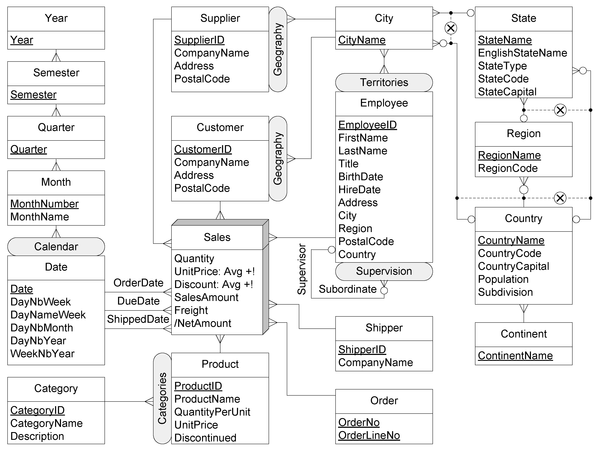

# 19/10 : Multidimensional model
The manager needs to identify the dimensions, the hierarchy, the levels, the fact, the measures. If he does this we are good.
- Hierarchy : connected with cardinality link
- ...

The "Notation" slide sums it really well.

- Fact : we choose a way to distinguish it. For example, we build it in a 3D box instead of easy 2D for others.

Additionnal things
- Types of measures
- Analysis criterion
- Cardinalities
- ...

There could be many facts !

Example of the northwind DW :

## Problem of double counting

