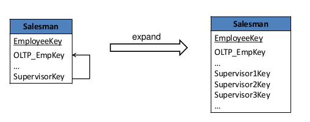
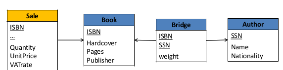
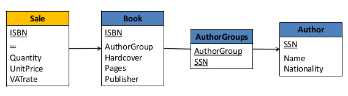

# 1. Logical Database design

## 1.1. About ROLAP

### 1.1.1. Option dimensions
- Issue : some rows don't have all the attributes, some are missing

- Solution :
  - we could put a `null` value but this is problematic because for some computations, `null` is absorbant.
    - Example : not all articles have a discount on them

### 1.1.2. Cross-dimensional attribute
  
### 1.1.3. Recursive hierarchy : 
- Easy to represent in relational DB
- How to avoid double counting ?
  - Need to design the SQL query to avoid double-counting.
  - At the schema level, easy.
- Solution : **expand** the hierarchy

In this example  : we store the supervisor of an employee at different levels. This way, we can retrieve the supervisors at all the levels without having to go in a recursion.

### 1.1.4. Multiple arc

- Represents a many-to-many relation. The issue is business-based. The way we handle it differs.

#### 1.1.4.1. Solution 1
- The issue : how much royalties every author will have on the sale of a book ? *We need to add a distribution factor*
- Add a bridge table with the weight of every author for every book

#### 1.1.4.2. Solution 2 : create artificial groups
- The issue : we want the measures to be about every author groups.
- We want to assign the measures to a particular group.
The issue is business-based ! This solution is for a measure that is around groups.

- Example : policemen are often in pairs, not alone ! We need to see for which pair there are problems, so the measure is about pairs.

- *Not a snowflake ! SQL queries for snowflake always start from the fact table and do some joins in all the directions. In this case we begin with **Sale** and make joins in the two directions, but the semantics.* (**not sure at all**)

Star or snowflake : 
- easy to write in SQL : group by ROLAP, etc. easy to do

Here : 
- Each time we want to handle a measure, for example solution 1, we need to have an intermediate step, in sol. 1 it is the bridge. Therefore, the SQL query will not be so simple. It is not as simple as star or snowflake schema. 

Exercices

