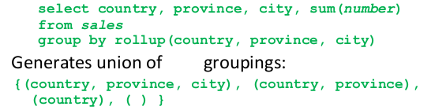

# 1. Summary by the date of November 2nd 2021

## 1.1. Introduction
### 1.1.1. OLTP
- Motivation : RDBMS are focused on supporting transaction processing, they are OLTP. 

OLTP : OnLine Transaction Processing

- For this purposes, they deal with :
  - ACID : atomicity, consistency, durability, isolation
  - Non-redundancy
  - Ad-hoc querying : we specify exactly what we want from the query
  - Efficiency : a DB usually contains indexes, database equivalents, to accelerate the scan of the DB
  
  - The queries are said to be many, frequent, concurrent, small, and ad-hoc.

### 1.1.2. Decision Support
What about business intelligence ? What about making statistics about the data to understand **what decision** one should make to improve its business ? We would like to create a report of data regularly. More precisely :
- Explore
- Concentrate on certain slices of the data
- Refine analysis in a suspicious region

This is almost impossible using original data sources and OLTP-geared systems.

Some features that were needed for OLTP are not needed anymore for a decision support system :
- Dealing with concurrent access : not needed anymore. Instead, we only have a read-only access.
- Data consistency, non-redundancy : not needed to be taken care of. Data comes from consistent sources, and do not change during analysis.
- Ad-hoc querying : this is no longer the case. We do not query the database for some precise short slice of data, but we query it with spread-sheet-like queries, it touches large parts of the database. In combination with transactions, it would kill the database.

In conclusion, OLTP systems are not very efficient for data analysis tasks. The architecture is even suboptimal. Some would think of denormalization as a first step to have something easier to access.

An additionnal crucial element is that we now neew **historical data**, and not anymore **current data**.

## 1.2. Data Warehouses
A Data Warehouse (DW) is a decision support DB maintained separately from the other operational databases. The separation is very important as it does not target the same data (historical for DW -- aka OLAP -- versus current for OLTP), neither has the same function (analytical processing for DW, versus transaction processing for OLTP).

In more concrete terms (lol), a DW is  :
- a subject-oriented (vs function-oriented),
- non-volatile (vs only holgind most recent version),
- integrated (has different data sources),
- time-variant (can be related to time),
- and supporting decision support

system.

### 1.2.1. Top-down versus bottom-up approaches
Different approaches exist to build a DW. One can oppose the top-down approach to the bottom-up approach.

Here are some slides and illustrations from Bernard ESPINASSE, Aix-Marseille Université.

### 1.2.2. OLAP : OnLine Analytical Processing
- An OLAP system is a system that supports analytical queries that are dimensional in nature.
- Most DWing systems support OLAP functionalities
- Online means : no waiting for answers.

## 1.3. Conceptual model : data cubes
See notes of course 3. We have
- Dimensions,
- Measures,
- Hierarchies in dimensions
- Possibility of aggregation = cross-tabulation

## 1.4. Query languages for supporting OLAP
### 1.4.1. Typical data cube operations
- Pivoting : basically cross-tabulation, 
- Browsing a cube
  - We can slice : select a part of the cube by restricting one or more dimensions to some values
  - Drill-down and roll-up : basically change level in hierarchy.
    - Drill-down : go down one level, from city to store
    - Roll-up : the inverse, from store to city.
    - Drill-through : go back to the original, individual data records
  - Dicing : roll-up on mupltiple dimensions at once

### 1.4.2. SQL extensions
- SQL has extensions for representing the cube, browsing, etc. It can also group by cube, group by roll-up, ...

- Special value null is used for the cross-tabulation results

- Group by cube computes the union of the different possible groupings of the relation by the precised attributes. For example :

- Group by rollup : generates union on every **prefix of specified list of attributes**
  - Particularly useful when there is a hierarchy between items !

Indeed, grouping by (province) does not make sense when we have a grouping by (country, province)
  - Multiple rollups and cubes can be used in a single "group by" clause ! For example, `group by rollup(...), rollup(...), cube(...)`

### 1.4.3. MDX
It is a query language for cubes that is used by many data warehousing systems. It is specially designed for DW. It is easy for simple queries but can be complex afterwards : be careful! 

## 1.5. Database explosion problem
[https://blog.coursera.org/solving-the-data-explosion-problem-with-university-of-illinois-data-mining-pioneer-jiawei-han/]

*Can you explain what you mean when you talk about a “Data Explosion” problem?*

Originally, people would say they are ‘data poor’ and that they couldn’t get enough data. Now there is lots of data–the new problem is actually extracting knowledge from it.

Whether you’re a journalist, a biologist, an engineer, or in almost any other discipline, there is this ‘data explosion’ problem: you need to turn unstructured data into structured knowledge. That means spend[ing] a lot of time figuring out how to structure your unstructured data into networks, and then how to mine that data. 

Often, the data in the DW is not **dense**. By dense, we mean that sequential values of the dimensions are belonging to a tuple in the DW. We say the data is **sparse**. The problem of this is the following.

If we try to do a straight-forward implementation, adding one tuple in a cube of 10 dimensions with 10 values ($10^{10}$ cells in the cube) will increase the count of $2 ^{10}$ cells.

The cube becomes enormous, so a smart way must come to implement a DW.

# 2. Logical database design

## 2.1. Star schema
Very simple : fact in the middle, and every dimension is linked to with the fact table.

## 2.2. Snowflake schema

Very simple : some dimensions are made *snowflake*, typically when the concerned level can take multiple values. For example, we don't want to describe the whole map of Brussels for every customer of Brussels.

**Important** : date is never in a snowflake schema, because date is in almost every query. It must be directly accessible without having to make joins each time.

So advantages is that it reduces size, it avoids redundancy, but a disadvantage is that it needs a lot more joins.

## 2.3. Fact constellation
Many fact tables some of the dimensions, trying to reuse the dimensions. But the problem is that a dimension may have different meaning for different facts. IRL : different sets of characteristics can be used to describe the same real object.

